# Auditoría de experiencia de usuario (UX) — Fase 1

Fecha: 4 de octubre de 2026.  
Alcance: Auditoría técnica y funcional de los tres recorridos principales de la aplicación FORJA en resoluciones de 375 px (móvil), 768 px (tableta) y 1280 px (escritorio), conforme a la tarea **F1-01** del [plan de implementación](implementation-plan.md).

---

## 1. Contexto y objetivos

FORJA es un sistema de conocimiento y toma de decisiones para el desarrollo físico de jóvenes deportistas. Su interfaz de usuario no es una simple web corporativa ni una tienda de rutinas: es una herramienta de trabajo para el entrenador y el preparador físico, utilizable tanto en el despacho (planificando y consultando) como en el gimnasio o en el campo (preparando o registrando la sesión en directo).

El objetivo de esta auditoría es:
1. Evaluar el estado actual de la interfaz en los tres dispositivos de referencia: **375 × 812 px** (móvil con una mano), **768 × 1024 px** (tableta vertical) y **1280 × 800 px** (ordenador de trabajo).
2. Identificar fricciones ergonómicas, problemas de accesibilidad (WCAG 2.2 AA) y barreras de uso en entornos reales de entrenamiento.
3. Priorizar los problemas para fundamentar la decisión de dirección de diseño **DEC-A** (tarea F1-02) antes de implementar las tareas F1-03 a F1-13.

---

## 2. Entorno y metodología de evaluación

- **Motor de renderizado:** Chromium (Google Chrome headless) sobre compilación de producción de Vite (`dist/`).
- **Resoluciones evaluadas:**
  - **Móvil (375 × 812 px):** Representa el uso en pista o gimnasio en dispositivos tipo iPhone 13 mini / smartphones compactos sostenidos habitualmente con una sola mano.
  - **Tableta (768 × 1024 px):** Representa el uso de soporte en banquillo o mesa técnica.
  - **Escritorio (1280 × 800 px):** Representa el trabajo de despacho, estudio de metodología y programación detallada.
- **Herramienta de reproducción:** Script canónico en [`scripts/capture-ux-audit.mjs`](../../scripts/capture-ux-audit.mjs).
- **Recorridos evaluados:**
  1. **Recorrido 1 — Consultar ejercicio:** Inicio (`/`) → Catálogo de ejercicios (`/exercises`) → Ficha detallada de ejercicio (`/exercises/sentadilla-goblet`).
  2. **Recorrido 2 — Preparar sesión:** Catálogo de sesiones (`/sessions`) → Detalle de plantilla (`/sessions/ses-002`) → Constructor de sesión (`/builder`).
  3. **Recorrido 3 — Ejecutar sesión:** Registro interactivo de sesión en pista (`/execution?session=ses-002`).

---

## 3. Evaluación detallada por recorrido

### Recorrido 1 — Consultar ejercicio

Este recorrido cubre el flujo en el que el entrenador busca un ejercicio específico, revisa sus criterios técnicos, patrones motores, prescripción recomendada y posibles adaptaciones (regresiones/progresiones).

#### 1. Inicio / Dashboard (`/`)

| Resolución | Captura | Observaciones de UX |
|---|---|---|
| **375 px** | 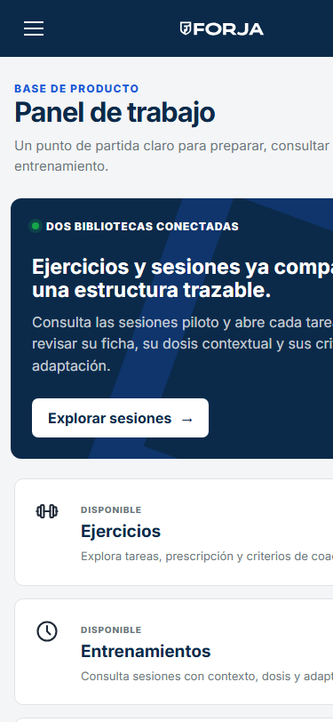 | La cabecera ocupa 64 px fijos con menú hamburguesa a la izquierda y logo centrado. Las áreas se apilan verticalmente en tarjetas grandes que requieren scroll prolongado. Falta un acceso directo a la «última tarea o borrador activo». |
| **768 px** | 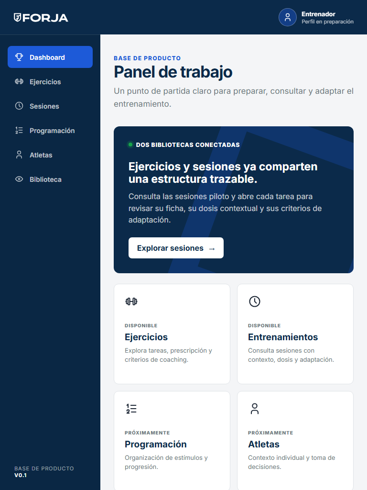 | Disposición en dos columnas. Buen equilibrio de información, aunque la navegación lateral sigue oculta tras el botón de menú. |
| **1280 px** | 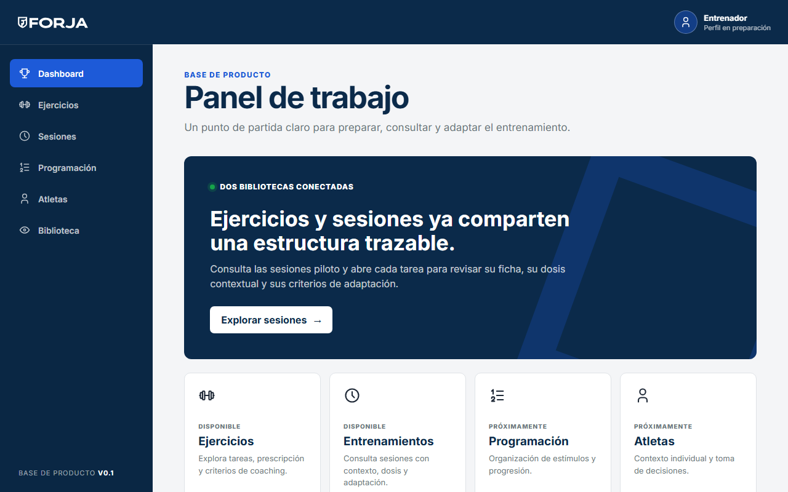 | Barra lateral persistente a la izquierda (`nav-item`) con iconos y etiquetas. Cabecera limpia con marcador neutro de perfil. La rejilla aprovecha bien el ancho sin desbordamiento. |

#### 2. Catálogo de ejercicios (`/exercises`)

| Resolución | Captura | Observaciones de UX |
|---|---|---|
| **375 px** | 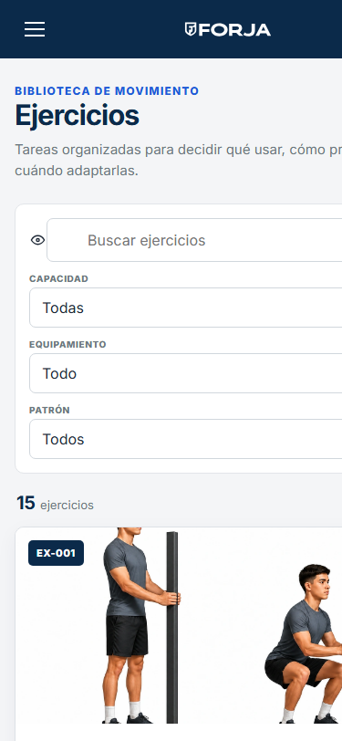 | **Fricción alta:** El campo de búsqueda y los tres selectores nativos (`Capacidad`, `Equipamiento`, `Patrón`) ocupan más de 380 px de altura, desplazando los resultados reales fuera del primer pliegue de pantalla (*above the fold*). Los desplegables nativos son pequeños para interacción táctil rápida. |
| **768 px** | 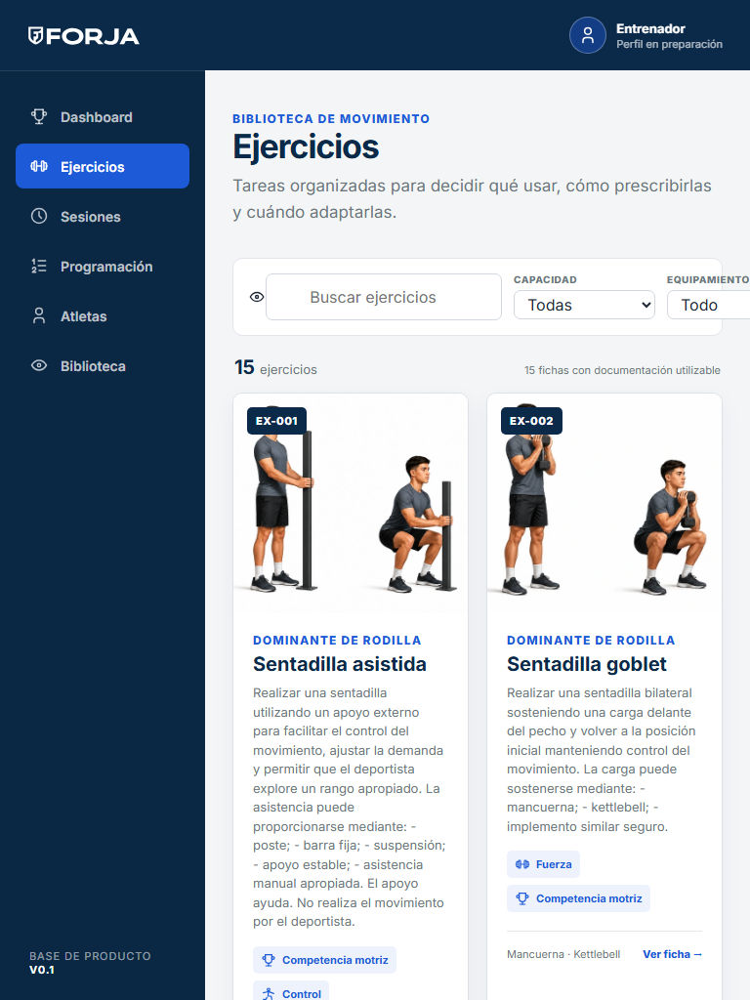 | Los filtros se organizan en 2 columnas y las tarjetas adoptan disposición horizontal (imagen a la izquierda y ficha a la derecha). Lectura clara y ágil. |
| **1280 px** | 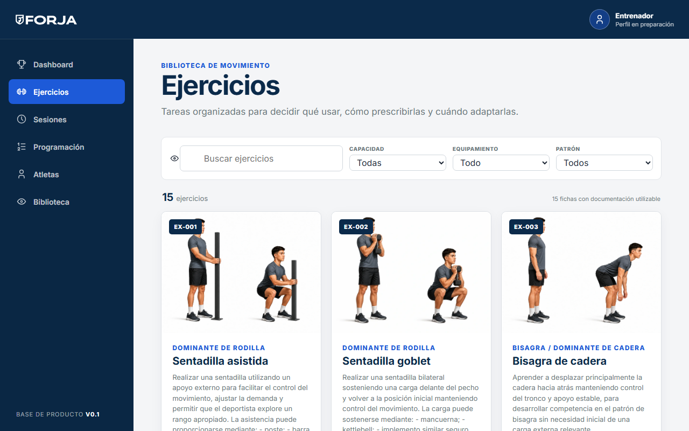 | Controles en una única línea superior. Rejilla fluida de 3 columnas de tarjetas con previsualización fotográfica del master y badges semánticos. |

#### 3. Ficha de detalle de ejercicio (`/exercises/sentadilla-goblet`)

| Resolución | Captura | Observaciones de UX |
|---|---|---|
| **375 px** | 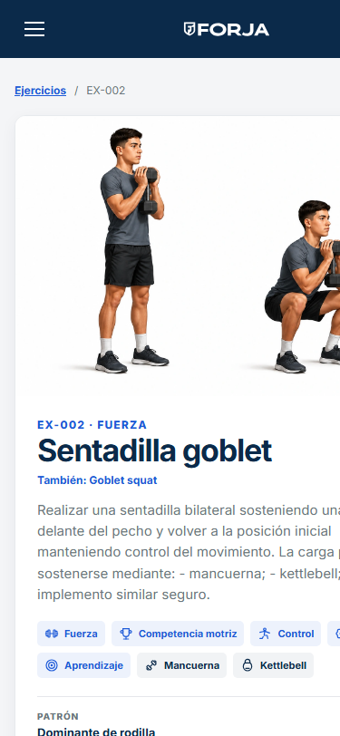 | **Fricción crítica:** En el campo, el entrenador necesita ver de un vistazo: *¿qué hago?*, *¿cuánto prescribo?* y *¿cuándo detengo el ejercicio?*. La estructura actual muestra una cabecera hero masiva con imagen y descripción general, obligando a realizar entre 3 y 5 desplazamientos de pantalla antes de llegar a la prescripción, errores comunes y adaptaciones. |
| **768 px** | 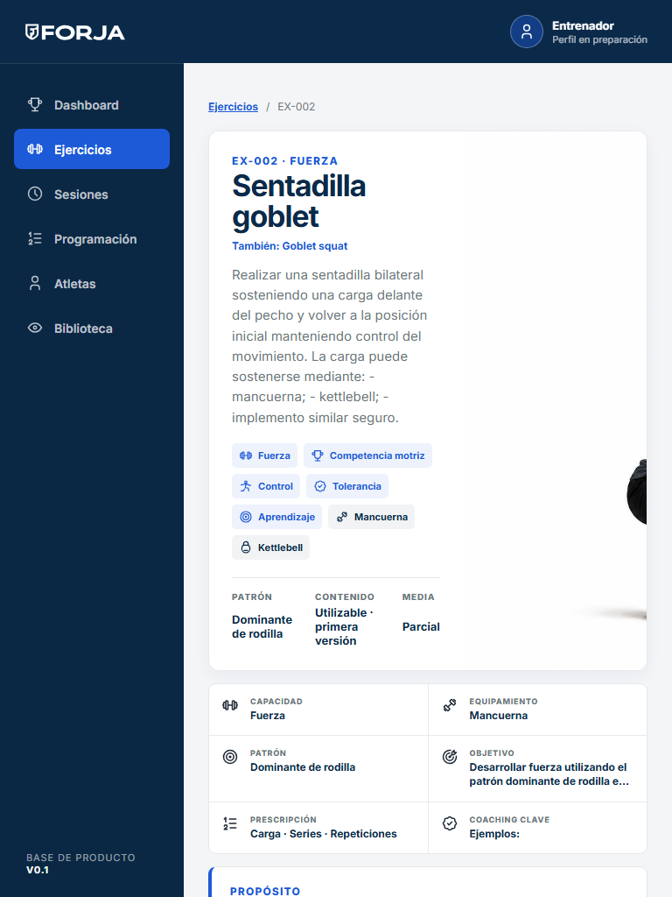 | Layout equilibrado de dos columnas en el hero. Las tablas de variables y bloques de consignas se leen con holgura. |
| **1280 px** | 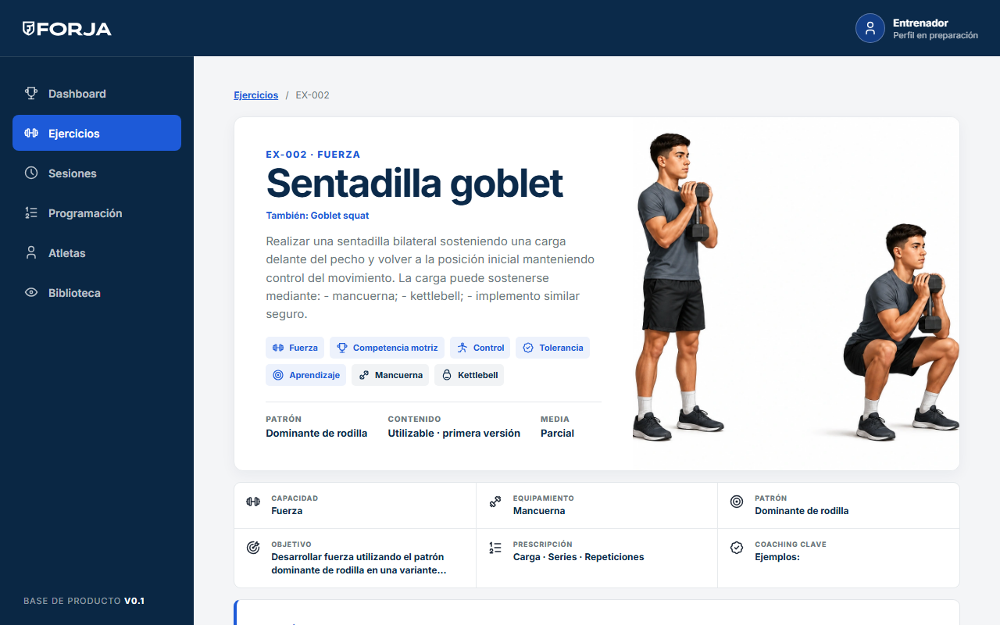 | Formato editorial técnico completo. Sin embargo, la gran cantidad de secciones consecutivas se beneficiaría de un índice anclado o navegación interna por pestañas. |

---

### Recorrido 2 — Preparar sesión

Este recorrido evalúa la selección de una sesión plantilla y su adaptación o personalización en el constructor local antes de aplicarla a los deportistas.

#### 1. Catálogo de sesiones (`/sessions`)

| Resolución | Captura | Observaciones de UX |
|---|---|---|
| **375 px** | 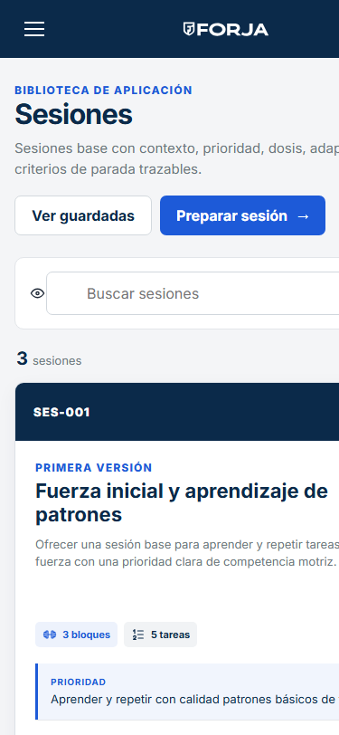 | Tarjetas apiladas legibles con metadatos contextuales (deporte, categoría, momento). Botones de acción claros («Ver ficha de sesión»). |
| **768 px** | 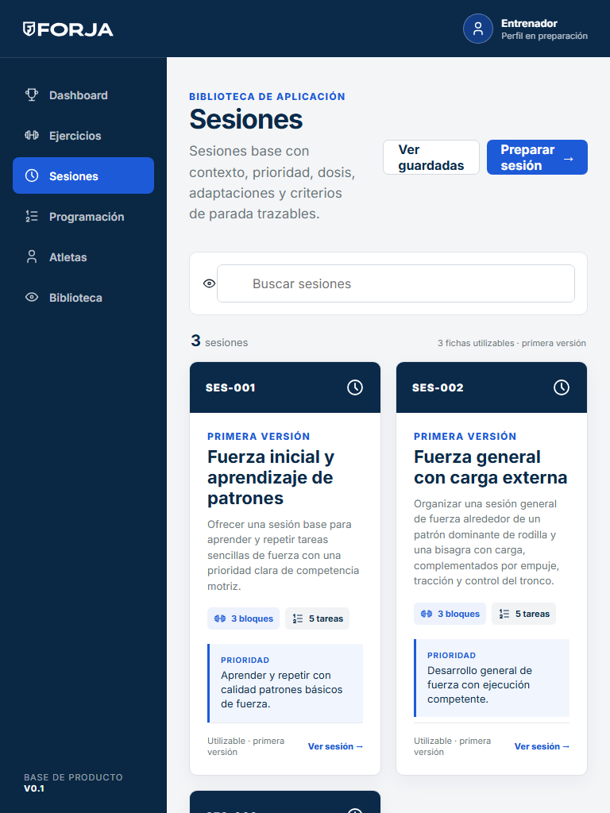 | Distribución en rejilla de tarjetas con visualización limpia de los criterios de aplicación. |
| **1280 px** | 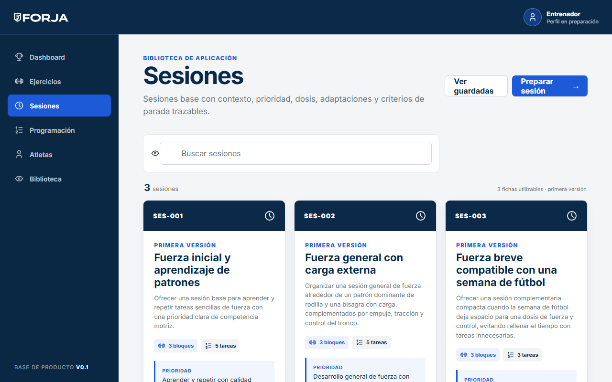 | Excelente visión panorámica de las plantillas canónicas validadas. |

#### 2. Detalle de sesión plantilla (`/sessions/ses-002`)

| Resolución | Captura | Observaciones de UX |
|---|---|---|
| **375 px** | 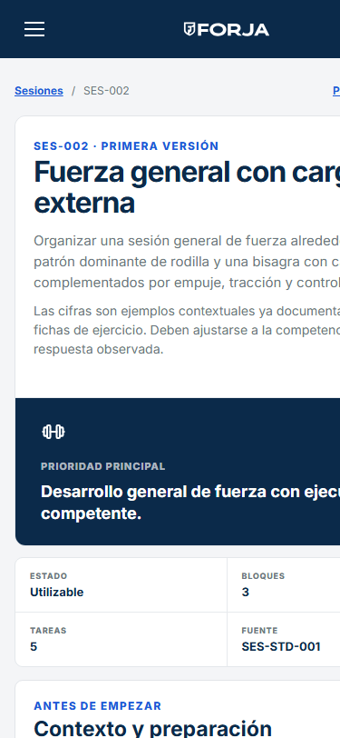 | Secciones secuenciales por bloques (Calentamiento, Parte principal, Vuelta a la calma). En móvil, los botones para pasar al constructor o iniciar la sesión quedan aislados en la cabecera. |
| **768 px** | 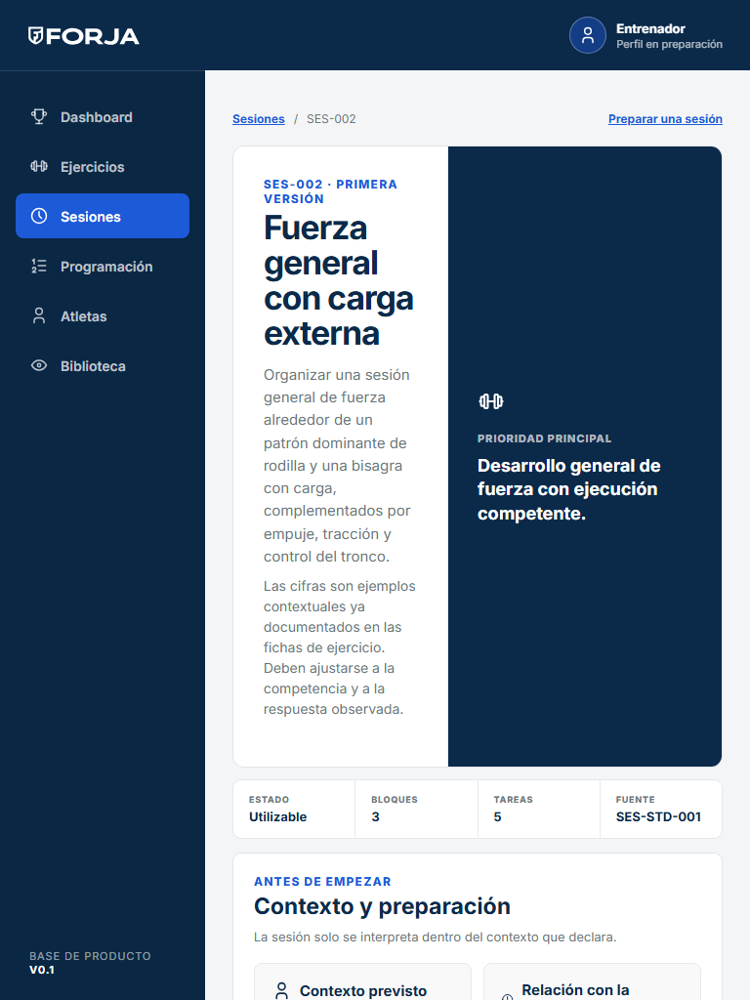 | Estructura en tarjetas de tareas bien jerarquizada con identificadores de ejercicio enlazados. |
| **1280 px** | 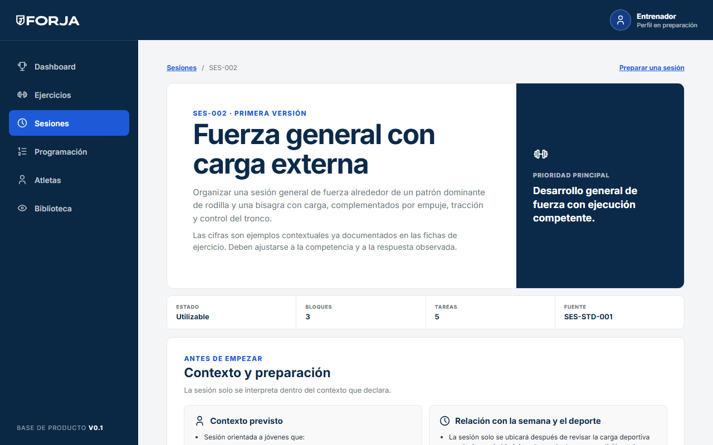 | Visión completa de tareas, adaptaciones y límites metodológicos del contexto. |

#### 3. Constructor de sesión (`/builder`)

| Resolución | Captura | Observaciones de UX |
|---|---|---|
| **375 px** |  | **Fricción alta:** El formulario apila verticalmente los campos generales y cada ejercicio con sus inputs de series, repeticiones, descansos y notas. El botón de guardar borrador no tiene fijación inferior, por lo que el entrenador debe desplazarse largas distancias para confirmar los cambios. |
| **768 px** | 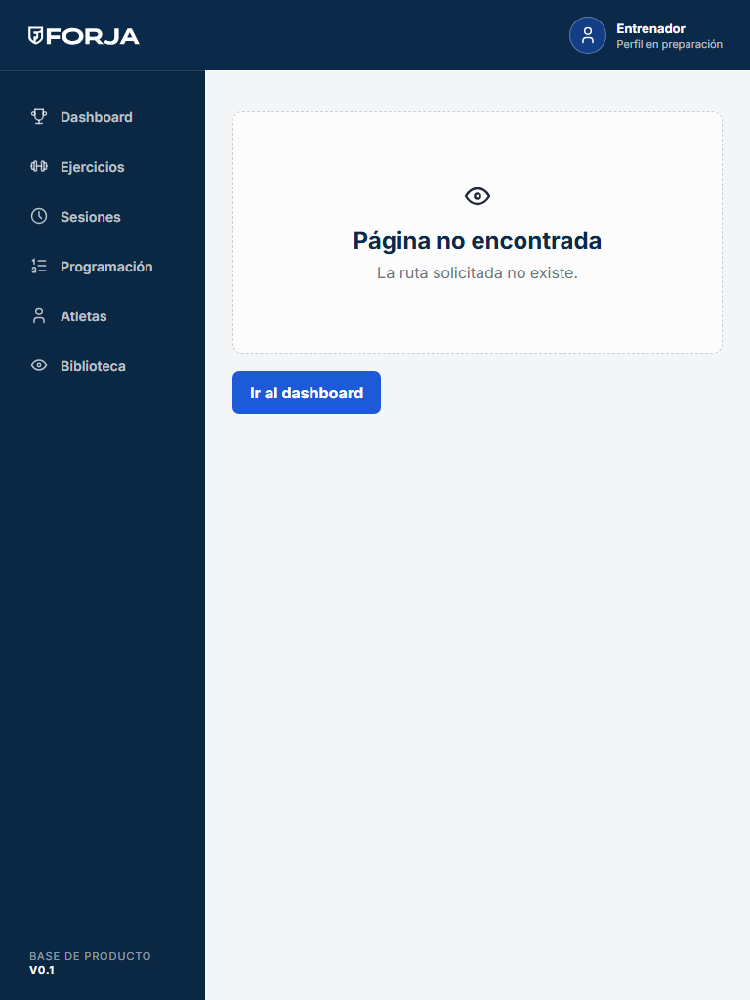 | Disposición en rejilla para los campos numéricos de prescripción, mejorando la densidad. |
| **1280 px** |  | Amplio espacio de trabajo. Permite editar y revisar simultáneamente la coherencia de la sesión. |

---

### Recorrido 3 — Ejecutar sesión

Este recorrido corresponde al momento operativo de mayor exigencia: la sesión está en marcha y el preparador debe verificar el estado del atleta, comprobar las tareas y registrar la ejecución (volumen completado, sensaciones, incidencias).

#### Ejecución de sesión interactiva (`/execution?session=ses-002`)

| Resolución | Captura | Observaciones de UX |
|---|---|---|
| **375 px** | 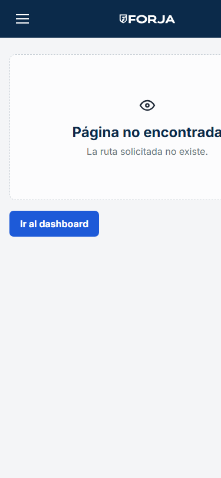 | **Fricción crítica (incompatibilidad con uso en pista):** La interfaz actual trata la ejecución como un formulario estático de escritorio en lugar de un modo guiado. El entrenador debe hacer zoom mental, rellenar campos de texto pequeños y desplazarse constantemente mientras vigila al deportista. Se requiere un verdadero **Modo Campo** con tarjetas tarea por tarea, botones táctiles gigantes (mínimo 48 px) y lectura clara a plena luz. |
| **768 px** |  | Adecuado para un asistente que anote datos en una mesa o banquillo, pero insuficiente para operación en movimiento. |
| **1280 px** | 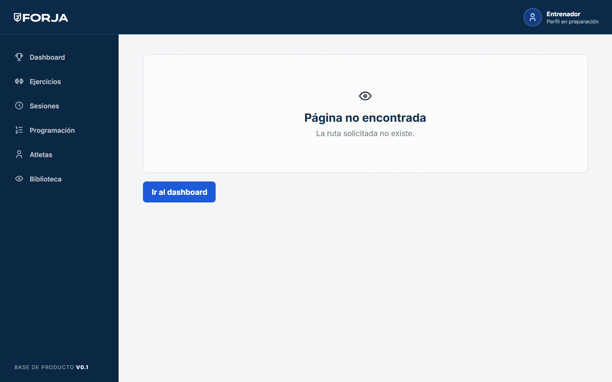 | Válido como pantalla de volcado o revisión post-entrenamiento. |

---

## 4. Matriz de problemas priorizados

| ID | Área / Pantalla | Problema detectado | Impacto en usuario | Severidad | Tarea del plan relacionada |
|---|---|---|---|---|---|
| **UX-01** | Ejecución de sesión (`/execution`) | Ausencia de «Modo Campo»: la pantalla es un formulario denso en lugar de un asistente paso a paso con botones grandes de un solo toque. | Crítico en móvil y pista | **Alta** | F1-11 |
| **UX-02** | Detalle de ejercicio (`/exercises/:id`) | Sobrecarga de scroll en móvil: la información operativa inmediata (objetivo, dosis, parada) queda sepultada tras más de 3 pantallas de scroll. | Alto en pista y consulta rápida | **Alta** | F1-08 |
| **UX-03** | Shell y navegación global (`AppShell`) | Navegación móvil basada en menú hamburguesa: requiere dos toques y mano alta para cambiar entre áreas de uso continuo (Ejercicios, Sesiones, Constructor). | Alto en navegación móvil diaria | **Alta** | F1-06 |
| **UX-04** | Catálogo de ejercicios (`/exercises`) | Panel de filtros superior muy alto: en 375 px ocupa casi toda la pantalla inicial, ocultando los ejercicios disponibles. | Alto en móvil | **Alta** | F1-09 |
| **UX-05** | Constructor de sesión (`/builder`) | Flujo monolítico sin barra de acciones persistente: guardar requiere desplazarse al extremo superior o inferior; edición de dosis farragosa en pantalla pequeña. | Medio-Alto en preparación | **Media** | F1-10 |
| **UX-06** | Dashboard principal (`/`) | Dashboard estático sin orientación a la acción: no destaca el borrador actual, la sesión pendiente de ejecutar ni accesos rápidos de campo. | Medio en flujo de trabajo | **Media** | F1-12 |
| **UX-07** | Tipografía y espaciado | Valores fijos en estilos de layout en lugar de escala tipográfica fluida (`clamp`) y márgenes adaptativos al contenedor. | Medio en consistencia | **Media** | F1-03, F1-04 |
| **UX-08** | Accesibilidad (WCAG 2.2 AA) | Varios botones secundarios y controles de filtro presentan áreas activas menores de 44 × 44 px; falta enlace visible «saltar al contenido». | Medio en accesibilidad | **Media** | F1-05, F1-06 |
| **UX-09** | Entorno visual en exteriores | Inexistencia de tema oscuro / alto contraste para condiciones de alta luminosidad o sol directo en campo. | Medio en exteriores | **Baja** | F1-07 (DEC-B) |

---

## 5. Fundamentación para la decisión DEC-A

El plan de implementación estipula en su tarea **F1-02** el registro de la decisión **DEC-A** relativa a la dirección de diseño de la Fase 1. A partir de los hallazgos de esta auditoría, se presentan las alternativas a considerar:

### Eje 1 — Navegación global en móvil (375 px)
- **Opción A (Navegación inferior / Bottom Bar):** Barra fija en la parte inferior con 4-5 destinos principales (Dashboard, Ejercicios, Sesiones, Constructor/Ejecución). Permite uso con el pulgar con una sola mano. Menú complementario para opciones secundarias. *(Recomendada por la ergonomía de campo).*
- **Opción B (Menú lateral hamburguesa optimizado):** Mantener el menú hamburguesa pero con apertura gestual suave y panel de acceso rápido superior.

### Eje 2 — Ficha de ejercicio y catálogo
- **Opción A (Revelación progresiva con pestañas / acordeones):** En móvil, separar la ficha en pestañas concisas («Prescripción y Dosis», «Técnica y Vídeo», «Adaptaciones y Progresión»). Filtros del catálogo en hoja inferior (*bottom sheet*) que se despliega solo bajo demanda.
- **Opción B (Vista continua compacta):** Reorganizar los bloques para que la dosis y la prescripción aparezcan inmediatamente bajo el título, manteniendo un scroll único pero reduciendo drásticamente la altura de las imágenes hero en móvil.

### Eje 3 — Ejecución de sesión
- **Opción A (Modo Campo por pasos):** Un componente tipo carrusel o asistente que muestra la tarea activa en pantalla completa, temporizador de descanso integrado, y botón grande para marcar como completada.
- **Opción B (Lista de verificación interactiva):** Mantener la sesión completa como lista continua pero con tarjetas de tarea colapsables y botones táctiles ampliados.

> **Regla de gobernanza:** Conforme a `AGENTS.md` y a las instrucciones de la tarea, ninguna de estas opciones DEC-* será adoptada ni implementada en código hasta que la persona usuaria revise esta auditoría y la decisión quede formalmente registrada en `docs/00-project/decisions.md`.
